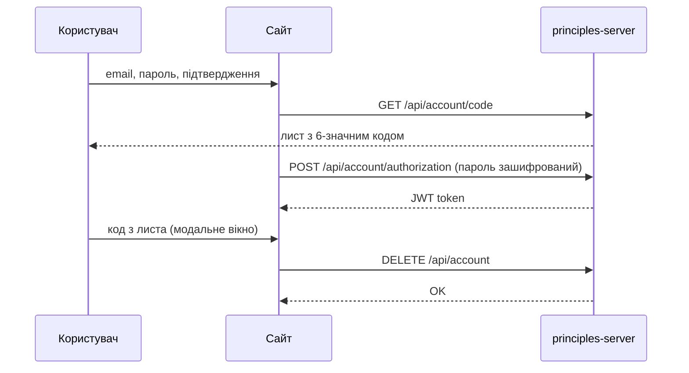

# Документація сайту Principles (new_web)

## Призначення

Це **статичний маркетинговий сайт** та сторінка **видалення акаунта** для мобільного застосунку Principles. Сайт не містить бекенду — усі дані йдуть на **principles-server** через REST API.

Старий сайт на ASP.NET (`web/`) видалено: функціонал перенесено сюди.

---

## Стек

| Технологія | Навіщо |
|------------|--------|
| React 19 | UI |
| Vite 8 | збірка та dev-сервер |
| CSS variables | 4 теми оформлення |
| Fetch API | запити до бекенду |

---

## Як працює навігація

Маршрутизації через React Router **немає**. У `App.jsx` читається `window.location.pathname` і рендериться одна з сторінок:

```
/                 → головна (лендінг)
/privacypolicy    → політика конфіденційності
/useragreement    → користувацька угода
/settings         → видалення акаунта
```

URL збігаються зі старим ASP.NET-сайтом для SEO та зовнішніх посилань.

---

## Головна сторінка

```
GetStarted.jsx
├── HeroSection          — заголовок, кнопка «Get started» (прокрутка до магазинів)
├── BenefitsSection      — переваги
├── StepsSection         — як працює застосунок
├── ReviewsSection       — відгуки
└── FinalCtaSection      — фінальний блок + кнопки Play / App Store
```

**Header.jsx** — логотип, посилання (Privacy, Agreement, Settings), вибір теми, мова EN/УКР, «Get started».

### Кнопки магазинів

`StoreDownloadButtons.jsx` + `utils/mobilePlatform.js`:

- на **телефоні** (Android / iOS) — **одна** кнопка (відповідний магазин);
- на **десктопі** — **обидві** кнопки.

Посилання в `config/storeLinks.js`.

---

## Локалізація та теми

| Файл | Роль |
|------|------|
| `locale/LocaleProvider.jsx` | контекст: мова + тема |
| `locale/translations.js` | тексти EN і UK |

**Теми:** `dark-orange`, `dark-blue`, `light-orange`, `light-blue` — зберігаються в `localStorage`, стилі через змінні в `App.css`.

---

## Юридичні сторінки

| Файл | Роль |
|------|------|
| `content/legalDocuments.js` | HTML-текст (згенерований) |
| `components/legal/LegalPage.jsx` | верстка + навігація по розділах |
| `pages/PrivacyPolicyPage.jsx` | обгортка Privacy |
| `pages/UserAgreementPage.jsx` | обгортка Agreement |

Джерело для регенерації: `scripts/legal-source/*.cshtml` (архів з колишнього `web/`).

```bash
yarn legal:generate
```

---

## SEO

| Файл | Роль |
|------|------|
| `components/SeoHead.jsx` | title, description, canonical, Open Graph |
| `config/seo.js` | метадані по сторінках і мовах |
| `public/robots.txt` | для пошукових роботів |
| `public/sitemap.xml` | карта сайту |

Змінна `VITE_SITE_URL` — базовий URL сайту.

---

## Сторінка Settings — видалення акаунта

### Потік



### Файли

| Файл | Роль |
|------|------|
| `pages/SettingsPage.jsx` | layout сторінки + посилання на магазини |
| `components/settings/DeleteAccountForm.jsx` | форма |
| `components/settings/EmailVerificationModal.jsx` | введення коду |
| `api/deleteAccount.js` | логіка API |
| `utils/passwordEncryption.js` | AES-CBC (як у мобільному застосунку) |

### Змінні середовища (`.env.local`)

| Змінна | Опис |
|--------|------|
| `VITE_API_PROXY_TARGET` | URL API (production або localhost:6001) |
| `FIRST_KEY_OF_PASSWORD_ENCRYPTION` | ключ AES (32 байт UTF-8) |
| `SECOND_KEY_OF_PASSWORD_ENCRYPTION` | IV (16 байт) |
| `VITE_SITE_URL` | URL сайту для SEO |

**Production:** ключі з `front/Principles/appsettings.json`.  
**Локальний back:** ключі з `back/SET.WebAPI/appsettings.Development.json`.

Якщо в ключі є `#`, `%`, `&` — обовʼязково в **лапках** в `.env`.

### Dev-режим

`vite.config.js` проксує `/api` → `VITE_API_PROXY_TARGET`.  
Запити з браузера йдуть на `/api/account/...` без CORS.

---

## Збірка та деплой

```bash
yarn build   # папка dist/
```

### Docker (EasyPanel)

У сервісі виберіть **Dockerfile** (не Buildpacks), порт контейнера **443** (HTTPS).

**Змінні середовища** задайте лише в EasyPanel/VPS (не в репозиторії й не в образі при збірці): `FIRST_KEY_OF_PASSWORD_ENCRYPTION`, `SECOND_KEY_OF_PASSWORD_ENCRYPTION`, за потреби `VITE_SITE_URL`, `VITE_API_BASE_URL`. При старті контейнера вони потрапляють у `/principles-env.js` (див. `docker/50-runtime-env.sh`). Локально — `.env.local` (див. `.env.example`).

TLS: змонтуйте сертифікат у контейнер як `/etc/nginx/ssl/fullchain.pem` і `/etc/nginx/ssl/privkey.pem` (наприклад Let's Encrypt з EasyPanel). Якщо файлів немає, при старті створюється self-signed (лише для тесту). HTTP (порт 80) перенаправляє на HTTPS.

```bash
docker build -t principles-website .
docker run -p 8443:443 \
  -e FIRST_KEY_OF_PASSWORD_ENCRYPTION="..." \
  -e SECOND_KEY_OF_PASSWORD_ENCRYPTION="..." \
  principles-website
```

На хостингу:

1. Роздавати `dist/` як статику (або образ з `Dockerfile` + `nginx.conf`).
2. SPA fallback: усі шляхи → `index.html`.
3. Проксі `/api` на principles-server (або `VITE_API_BASE_URL` при збірці).

---

## Повʼязані репозиторії

| Репозиторій | Роль |
|-------------|------|
| `back/SET.WebAPI` | REST API, БД, пошта з кодами |
| `front/Principles` | мобільний застосунок |

---

## Що було видалено при очистці

- **`web/`** — старий ASP.NET сайт (функціонал перенесено).
- **`scripts/compareEncrypt/`** — тимчасовий інструмент порівняння шифрування.
- Юридичні `.cshtml` збережено в **`scripts/legal-source/`** для `yarn legal:generate`.
